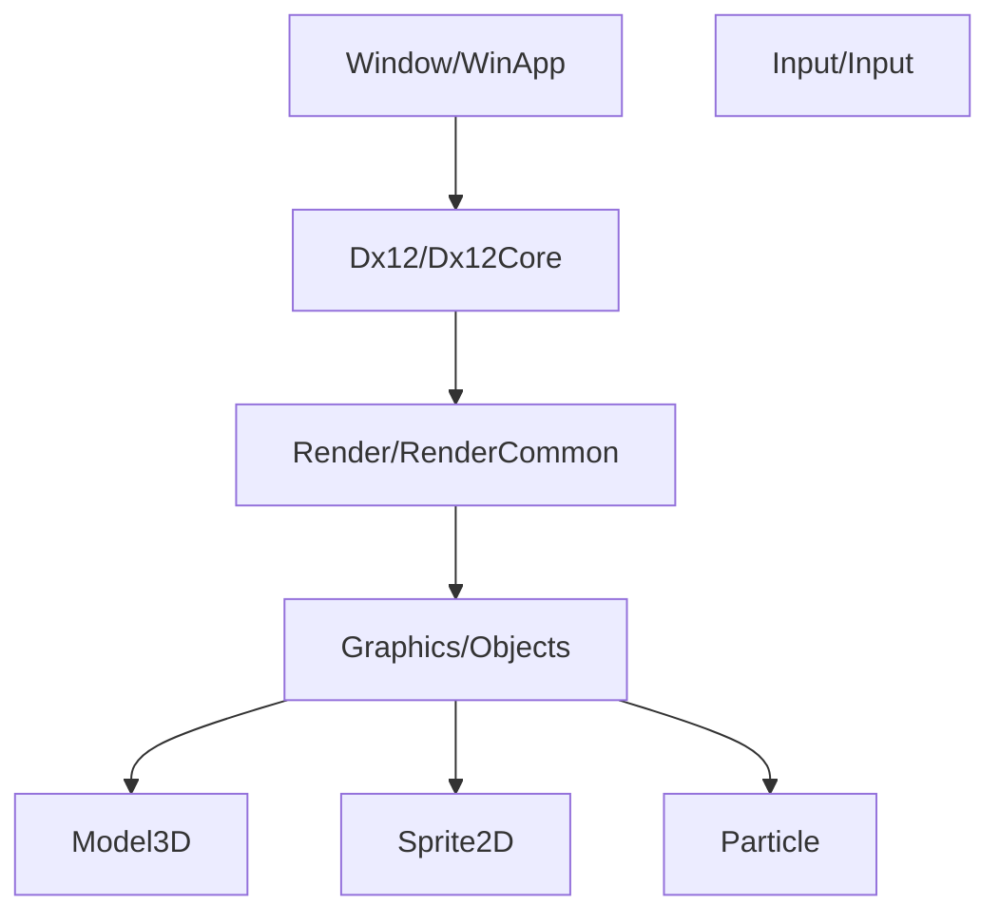

# master

# GE3 branch

# CG2 Engine

本プロジェクトの心臓部となる、DirectX 12ベースの自作ゲームエンジンです。
アプリケーション（Game部分）から分離され、描画、入力、ウィンドウ管理、リソース管理などの基盤機能を提供します。

## 構成図 (主要レイヤー)

## ディレクトリ構成と役割

### 1. コア・システム層
DirectX 12の初期化や、Windows OSとのやり取りを担当します。

- **[Dx12/](file:///c:/Users/rea/source/repos/2025/CG2/CG2/project/engine/Dx12/)**: DirectX 12のラッパー群。
  - `Dx12Core`: デバイス、コマンドリスト、スワップチェーン、ディスクリプタヒープの一括管理。
  - `GraphicsPipeline`: パイプライン状態オブジェクト（PSO）の生成。
- **[Window/](file:///c:/Users/rea/source/repos/2025/CG2/CG2/project/engine/Window/)**: Win32 APIによるウィンドウ生成とメッセージループ。
- **[Input/](file:///c:/Users/rea/source/repos/2025/CG2/CG2/project/engine/Input/)**: DirectInput/XInputによるキーボード、マウス、コントローラー入力の管理。

### 2. レンダリング・グラフィックス層
描画パイプラインの制御と、具体的な描画オブジェクトの実装です。

- **[Render/](file:///c:/Users/rea/source/repos/2025/CG2/CG2/project/engine/Render/)**: レンダリングフローの管理。
  - `RenderCommon`: エンジン全体の描画に関する共通設定やパイプライン管理。
- **[Graphics/](file:///c:/Users/rea/source/repos/2025/CG2/CG2/project/engine/Graphics/)**: 具体的な描画機能。
  - `Model3D`: 3Dモデル（.obj等）の読み込みと表示。
  - `Sprite2D`: 2Dテクスチャ、スプライトの表示。
  - `Primitive3D / Primitive2D`: 線や立方体などの基本図形。
  - `Texture`: テクスチャリソースの読み込みと管理。
- **[Particle/](file:///c:/Users/rea/source/repos/2025/CG2/CG2/project/engine/Particle/)**: パーティクルエミッターと計算。

### 3. ユーティリティ
- **[Common/](file:///c:/Users/rea/source/repos/2025/CG2/CG2/project/engine/Common/)**:
  - `Math`: ベクトル・行列演算ライブラリ。
  - `Log`: デバッグ出力用ユーティリティ。
- **[ImGuiManager/](file:///c:/Users/rea/source/repos/2025/CG2/CG2/project/engine/ImGuiManager/)**: 開発用GUI（ImGui）の統合。

## 主要なクラスと機能

### Dx12Core
エンジンの最下層に位置し、以下のリソースを保持・提供します。
- `ID3D12Device`: GPUデバイス
- `ID3D12GraphicsCommandList`: 描画コマンド発行用
- `DescriptorHeap`: SRV/RTV/DSVの管理

### RenderCommon
描画パスの開始・終了、ルートシグネチャの設定、共通定数バッファ（View/Projection等）の管理を行います。

---
> [!NOTE]
> 本エンジンは学習および研究目的で開発されています。
