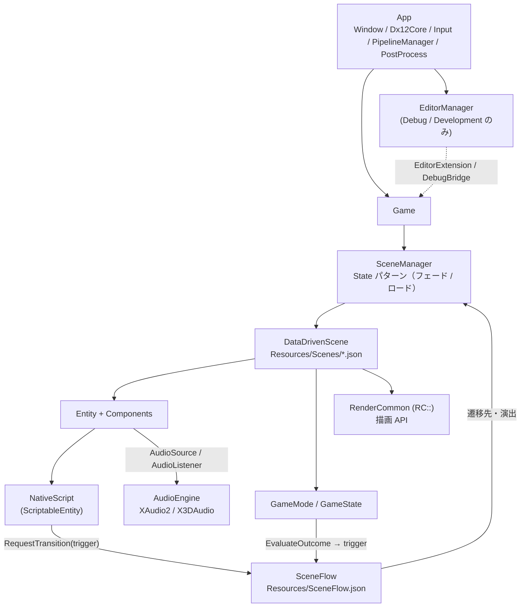
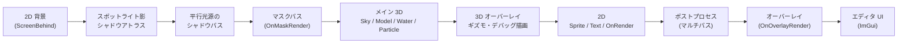

# Chaso Engine

DirectX 12ベースの自作ゲームエンジンです。
エンジン層 (`ChasoEngine`) とアプリケーション層 (`ChasoApp`) に分離されており、描画・音響・入力・ECS・エディタ・シーン管理の基盤を提供します。

[](https://github.com/taiga-0505/Chaso/actions/workflows/DebugBuild.yml)
[](https://github.com/taiga-0505/Chaso/actions/workflows/ReleaseBuild.yml)
[](https://github.com/taiga-0505/Chaso/actions/workflows/CheckUnwantedFiles.yml)

## 概要 (Overview)

本プロジェクトは、DirectX 12を用いた低レイヤーのグラフィックスプログラミングの学習および、高性能なゲーム制作を目的として開発されています。
エンジン機能は静的ライブラリ (`ChasoEngine`) として分離され、別リポジトリ **[ChasoEngine](https://github.com/taiga-0505/ChasoEngine)** で管理しています。
ゲームロジックはアプリケーション層 (`ChasoApp`) に NativeScript として実装し、シーンは JSON によるデータ駆動で構成します。

## 主な機能 (Features)

### レンダリング基盤 (Rendering Core)
- **コマンドキュー方式の描画**: 描画要求を 64bit ソートキー（レイヤー / PSO / テクスチャ / 深度）で並べ替え、ステート変更を削減（`SortKey`）。
- **フレームリソース**: トリプルバッファのリニアアロケータで定数バッファ / StructuredBuffer を毎フレーム確保（`FrameResource`）。
- **遅延解放**: フェンス値で GPU の参照完了を待ってからリソースを解放し、シーン遷移や差し替え時のクラッシュを防止（`DeferredReleaseQueue`）。
- **非同期ロード**: `std::async` によるモデル・テクスチャのバックグラウンドロード。シーン遷移時は未完了のロードを自動待機（`WaitAllLoads`）し、ロード未完了オブジェクトの描画はガード。
- **フォールバック**: テクスチャの読み込みに失敗しても白 1x1 で代替して描画を継続（`Texture2D::IsFallback` で判別可能）。
- **シェーダ**: HLSL (Shader Model 6.0+ / DXC)。パイプラインの再ビルド（シェーダのホットリロード）に対応。コンパイル失敗時はファイル未検出などの理由も含めてログに出力。
- **Compute Shader**: 汎用 `ComputeShader` クラスによる GPU 汎用計算（スキニング、パーティクル、波紋シミュレーション等）。

### 3Dグラフィックス
- **モデル**: [Assimp](https://github.com/assimp/assimp) による .obj / .gltf / .glb / .fbx 等の読み込み（`aiProcess_MakeLeftHanded` で左手系に統一）。色・光沢・法線マップ・ラフネスマップ・環境マップ係数の設定、ガラス表現（2 パス描画）、色違いのバッチ描画に対応。
- **スケルタルアニメーション**: ボーン階層・InverseBindPose・キーフレーム補間。GPU スキニング、クリップ間のクロスフェード、スケルトンのデバッグ表示。
- **ボーン追従（ソケット）**: 他エンティティの Joint にモデルを貼り付け（`BoneAttachmentComponent`。武器を手に持たせる等）。
- **プリミティブメッシュ**: Plane / Box / Sphere / Cylinder / Cone / Torus / Capsule / Circle / Ring などを実行時生成（`PrimitiveMeshComponent`）。
- **3D 文字メッシュ**: DirectWrite のグリフアウトラインを Direct2D のジオメトリ演算で三角形分割・押し出しした立体文字（`TextMeshComponent`）。厚さ・フォント・色・テクスチャ・法線マップ・縁取りを Inspector から編集可能。
- **水面**: Gerstner 波による海面（`WaterComponent`）、Compute Shader による弾着などのインタラクティブな波紋、障害物による波の反射。CPU 側でも同じ式で水面高さ・法線を求められる（`WaterSurface`。浮力・着水判定用）。
- **背景**: Skybox（キューブマップ / 環境マップ）、Skydome。
- **影**: 平行光源のシャドウマップ、スポットライトごとの影（シャドウアトラス）。
- **マスクパス**: 特定オブジェクトだけのシルエットを書き込み、輪郭を強調（インタラクト対象のハイライト等）。

### 2Dグラフィックス
- **スプライト**: スクリーン空間（手前 / 背景）とワールド空間（深度テストあり）の 3 モード（`SpriteRendererComponent`）。
- **文字描画**: DirectWrite で TTF / OTF / TTC を動的アトラスへラスタライズ（`FontAtlas` / `FontManager`）。ハンドル制・参照カウント・キャッシュ付き。`TextRendererComponent` で画面上に表示。
- **デバッグ描画**: 2D（線・矩形・円・三角形）、3D（線・AABB・OBB・球・カプセル・円弧・視錐台・グリッド）。

### ライティング (Lighting)
- 平行光源 (Directional)・点光源 (Point)・スポットライト (Spot)・面光源 (Area) に対応。複数ライトのアクティブ登録。
- ライティングモード（None / Lambert / HalfLambert）をモデル単位で上書き可能。
- 選択中のライトに対するワイヤフレームギズモ（平行矢印 / 球リング / コーン / AABB）。

### ポストプロセッシング (Post-Processing)
ピンポンバッファによるマルチパスで、以下のエフェクトを任意に重ねがけできます。

| 分類 | エフェクト |
| :--- | :--- |
| 色調 | Grayscale / Sepia / Vignette / ColorGrade（露出・コントラスト・彩度・色温度） |
| ぼかし・AA | BoxFilter / GaussianFilter / RadialBlur / Bloom / Fxaa |
| 輪郭・陰影 | DepthBasedOutline / MaskOutline / Ssao |
| 演出 | Dissolve / RandomNoise / ScreenDroplets（レンズ水滴）/ BloodOverlay（被弾）/ InkOverlay（墨） |
| 水中 | Underwater / Caustics / LightShaft（レイマーチ型ボリュームライト） |

画面全体のフォグオーバーレイも用意しています。

### パーティクル (Particle)
- **GPU パーティクル**: Compute Shader で射出・更新・描画を行う FreeList 方式（`GPUParticle` / `GPUParticleComponent`）。
- 挙動タイプ（Default / Explosion / Rain / Fire / Electric）を切り替えると Emit / Update の CS を動的に差し替え。
- エディタの **Particle Editor** で専用プレビューを見ながらパラメータを調整可能。

### オーディオ (Audio)
- **XAudio2 ベースの `AudioEngine`**（シングルトン）。デバイスが無い環境でも無音で動作を継続。
- **デコード**: .wav は自前の RIFF パーサ、.mp3 などは Media Foundation の SourceReader で PCM に変換。
- **クリップキャッシュ**: 同じパスは 1 回だけロードし参照カウントで管理。`PurgeUnusedClips()` でシーン遷移後に未使用分だけ解放。
- **バス**: BGM / SE の 2 系統とマスター音量。
  - **BGM**: 常に 1 本。keep-alive 方式で、次のシーンにも同じ曲を置けば途切れずに継続し、誰も鳴らさなくなると自動停止。
  - **SE**: 重ね再生。鳴り終わったボイスは自動回収。
- **3D 音響（X3DAudio）**: 左右の定位・距離減衰（Logarithmic / Linear）・ドップラー効果。スロットごとに 2D / 3D を上書き可能。
- **ECS 連携**:
  - `AudioSourceComponent`（Unity の AudioSource 相当）: 名前付きスロット（"shoot" / "damage" 等）に音を登録し、スクリプトから `Play("shoot")`。`playOnAwake` でコード無しに BGM を鳴らせる。
  - `AudioListenerComponent`: 聞き手を任意のエンティティに（未配置なら描画中のカメラ）。向きだけカメラに合わせることも可能。

### ECS / スクリプト (Entity-Component-System)
- **Entity + IComponent** ベースの軽量 ECS。エンティティ単位の可視性 (`IsVisible`) / ロック (`IsLocked`)、親子階層、GUID。
- **主なコンポーネント**: Transform / ModelRenderer / Animation / BoneAttachment / PrimitiveMesh / SpriteRenderer / TextRenderer / TextMesh / Water / GPUParticle / Skybox / Skydome / Light（4 種）/ Camera / Collider（AABB・Sphere・Capsule、レイヤーのビットマスク、トリガー）/ Rigidbody（重力・キネマティック）/ AudioSource / AudioListener / NativeScript。
- **NativeScript**: `ScriptableEntity` を継承した C++ スクリプト（Unity の MonoBehaviour 相当）。
  - ライフサイクル: `OnCreate` / `OnUpdate` / `OnDestroy` / `OnCollision`。
  - 描画フック: `OnRender` / `OnOverlayRender` / `OnShadowRender` / `OnMaskRender` / `OnDebugRender` / `OnColliderDebugRender`。
  - `Serialize` / `Deserialize` / `OnImGui` でパラメータをシーン JSON に保存し、Inspector で編集。
  - `REGISTER_SCRIPT` マクロで `ScriptRegistry` に名前登録し、エディタやシーン JSON から生成。

### シーン / ゲームフレームワーク (Scene & Game Framework)
- **DataDrivenScene**: `Resources/Scenes/*.json` からエンティティを構築。エディタで編集・保存（Ctrl+S）。
- **LevelLoader**: Blender のレベルエディタが出力した JSON（メッシュ・ライト・カメラ・プレイヤー / 敵スポーン）を読み込み。
- **SceneManager**: State パターンで通常 / フェードアウト / ロード / フェードインを管理。遷移演出は `dissolve`（ノイズディゾルブ → 白黒から色が戻る）と `dive`（水面へ飛び込む短い遷移）。
- **SceneFlow（シーン遷移表）**:
  - 「どのシーンで・何が起きたら・どこへ・どの演出で」を `Resources/SceneFlow.json` に一元管理。
  - スクリプトはシーン名を書かず、`RequestTransition("start")` のように **きっかけ（trigger）名だけ** で遷移。
  - `from` は完全一致 / `"Stage*"`（前方一致）/ `"*"`（全シーン）。`to` には `$current`・`$arg`・アプリ登録変数（例: `$nextStage`）が使える。
- **GameModeBase / GameStateBase**: Unreal Engine の `AGameModeBase` / `AGameStateBase` に相当。
  - GameMode: `OnSceneEnter` / `EvaluateOutcome`（決着判定 → SceneFlow の trigger を返す）/ `OnLevelEnemySpawned` などのフックを Application 側で実装し、`SetFactory` で登録。
  - GameState: スコア・経過時間の保持とリセット。

### 入力 / ウィンドウ / 基盤 (Input, Window, Core)
- **入力**: `Input` クラスで統括。`Keyboard` / `Mouse`（DirectInput）、`Controller`（XInput。スティック・トリガー・振動）。
- **カメラ**: `MainCamera` とデバッグ用の自由移動 `DebugCamera` を `CameraController` で切り替え。スクリーン ⇔ ワールド変換、レイ生成などの `CameraMath`。
- **ウィンドウ**: Win32 API。解像度・フルスクリーンの動的変更、ボーダーレス時の Alt + ドラッグ移動。
- **設定**: `AppConfig.json` で解像度・フルスクリーン・V-Sync、構成（Debug / Development / Release）別のウィンドウタイトルと起動シーン（`bootScene`）。
- **FPS 制御**: デルタタイム計算と 60FPS 固定。
- **ログ**: `Log` による標準出力 + ファイル出力（`logs/app/`）。`Log::Fatal` は Release でも確実に停止。
- **ネットワーク**: libcurl / cpp-httplib を同梱（ネットワーク機能の実装に向けた準備段階）。

### エディタ (Editor)
[ImGui](https://github.com/ocornut/imgui)（ドッキング対応）と [ImGuizmo](https://github.com/CedricGuillemet/ImGuizmo) を統合した実行時エディタです。Debug / Development ビルドでのみ有効（`RC_ENABLE_IMGUI`）。

| パネル | 内容 |
| :--- | :--- |
| **Hierarchy** | エンティティ一覧（アイコン付き）。目アイコンで可視性、鍵アイコンでロック。フォルダ・ドラッグ＆ドロップでの親子付け・リネーム・削除 |
| **Inspector** | Transform・各コンポーネント・スクリプトのパラメータをリアルタイム編集。Add / Remove Component。音源の試聴 |
| **Viewport** | ゲーム画面。ギズモによる移動 / 回転 / 拡縮、再生 / 一時停止 / 停止、シェーディングモード切り替え（Solid / Wireframe / SolidWireframe / FaceOrientation / RandomColor / SolidShading） |
| **Content Browser** | リソースの閲覧とドラッグ＆ドロップでの割り当て |
| **Scene Flow** | シーン遷移表の編集（未保存の変更は Ctrl+S でシーンと一緒に保存） |
| **Environment Settings** | シーンの Skybox / Skydome（背景・環境）の設定 |
| **Post Effect Settings** | ポストエフェクトの積み重ねとパラメータ調整 |
| **Particle Editor** | GPU パーティクルの専用プレビューとパラメータ調整 |
| **Console / Performance / Render Queue** | ログ表示、FPS 計測、描画キューのダンプ |
| **キー操作一覧** | Help メニューから。デバッグキー・ショートカット・カメラ操作の一覧 |

- **編集操作**: Undo / Redo（Ctrl+Z / Ctrl+Y）、コピー＆ペースト（Ctrl+C / Ctrl+V）、空エンティティ作成（Ctrl+Shift+N）。
- **撮影モード / 録画**: F11 でゲーム画面だけを全画面表示、F10 で Media Foundation による MP4 録画。F2 でスクリーンショット。
- **EditorExtension**: `CHASO_EDITOR_EXTENSION` マクロで Application 側からゲーム専用のデバッグパネルを Window メニューに登録。エディタ本体はゲーム固有の型を知らずに済む。
- **DebugBridge**: 確認用 UI からシーン切り替えなど「アプリ側にしかできないこと」を依頼するための細い口。

#### デバッグキー（Debug / Development ビルドのみ）

| キー | 動作 |
| :--- | :--- |
| F1 | ゲームカメラ / デバッグカメラの切り替え |
| F2 | スクリーンショット |
| F3 | コライダーを全部表示 |
| F4 | デバッグ描画を全部表示 |
| F10 | 録画（MP4）の開始 / 停止 |
| F11 | 撮影モードの開始 / 終了 |

デバッグカメラは WASD で移動、E / Q で上下、矢印キーまたは右ドラッグで回転、Shift + 中ドラッグで平行移動、ホイールで前後移動です。

## 動作環境 (Requirements)

- **OS**: Windows 10 / 11 (x64)
- **DirectX**: DirectX 12 (Feature Level 12.0以上)
- **IDE**: Visual Studio 2026 (v145セット)
- **言語**: C++20

## プロジェクト構成 (Project Structure)

本ソリューション (`chaso.sln`) は以下の2プロジェクトで構成されています。

| プロジェクト | 種別 | 役割 |
| :--- | :--- | :--- |
| **ChasoEngine** | 静的ライブラリ (.lib) | 描画・音響・入力・ECS・エディタ・シーン管理等のエンジンコア |
| **ChasoApp** | 実行ファイル (.exe) | ゲームロジック（NativeScript / GameMode） |

ビルド構成は次の 3 つです。

| 構成 | 用途 |
| :--- | :--- |
| **Debug** | 開発用。エディタ・デバッグキー有効 |
| **Development** | 最適化ありでエディタ・デバッグキー有効（`RC_DEVELOPMENT`） |
| **Release** | 配布用。エディタ・デバッグキーは無効 |

## アーキテクチャ (Architecture)

### 全体構成

`App` がサブシステムを所有し、`Game` → `SceneManager` → `DataDrivenScene` の順にシーンを駆動します。
ゲーム固有の処理は Application 側の NativeScript と GameMode に閉じ込め、エンジンはゲームの型を知らない構成です。


```mermaid
flowchart TD
  App["App<br/>Window / Dx12Core / Input / PipelineManager / PostProcess"]
  Editor["EditorManager<br/>(Debug / Development のみ)"]
  Game["Game"]
  SM["SceneManager<br/>State パターン（フェード / ロード）"]
  DDS["DataDrivenScene<br/>Resources/Scenes/*.json"]
  Entity["Entity + Components"]
  Script["NativeScript<br/>(ScriptableEntity)"]
  GM["GameMode / GameState"]
  Flow["SceneFlow<br/>Resources/SceneFlow.json"]
  RC["RenderCommon (RC::)<br/>描画 API"]
  Audio["AudioEngine<br/>XAudio2 / X3DAudio"]

  App --> Game
  App --> Editor
  Game --> SM
  SM --> DDS
  DDS --> Entity
  DDS --> GM
  Entity --> Script
  Script -- "RequestTransition(trigger)" --> Flow
  GM -- "EvaluateOutcome → trigger" --> Flow
  Flow -- "遷移先・演出" --> SM
  DDS --> RC
  Entity -- "AudioSource / AudioListener" --> Audio
  Editor -. "EditorExtension / DebugBridge" .-> Game
```

### 1 フレームの描画順

`DataDrivenScene::Render` で 3D / 2D を中間レンダーテクスチャに描き、`App` がポストプロセスとエディタ UI を重ねます。


```mermaid
flowchart LR
  BG["2D 背景<br/>(ScreenBehind)"] --> SS["スポットライト影<br/>シャドウアトラス"]
  SS --> DS["平行光源の<br/>シャドウパス"]
  DS --> MK["マスクパス<br/>(OnMaskRender)"]
  MK --> M3["メイン 3D<br/>Sky / Model / Water / Particle"]
  M3 --> OV3["3D オーバーレイ<br/>ギズモ・デバッグ描画"]
  OV3 --> D2["2D<br/>Sprite / Text / OnRender"]
  D2 --> PP["ポストプロセス<br/>(マルチパス)"]
  PP --> OVL["オーバーレイ<br/>(OnOverlayRender)"]
  OVL --> UI["エディタ UI<br/>(ImGui)"]
```

ポストプロセス後のオーバーレイには、ポーズメニューのように画面効果を受けたくない UI を描きます。

## スクリプトの書き方 (Quick Start)

### NativeScript の最小例

`Application/Game/Scripts/` に `.cpp` を追加し（`ChasoApp` プロジェクトに登録）、`REGISTER_SCRIPT` で登録すると、Inspector の **Add Component > Native Script** のプルダウンに表示されます。

```cpp
#include "ECS/ScriptableEntity.h"
#include "ECS/ScriptRegistry.h"
#include "ECS/TransformComponent.h"
#include "ECS/AudioSourceComponent.h"
#include "Common/SceneContext.h"
#include "Input/Input.h"
#if RC_ENABLE_IMGUI
#include "imgui/imgui.h"
#endif

/// @brief 回転しながら、Space で音を鳴らし、Enter で次のシーンへ進むスクリプト
class SpinnerScript : public ScriptableEntity {
public:
  float speed = 1.0f; ///< 回転速度（Inspector で調整、シーン JSON に保存）

  void OnCreate() override {}

  void OnUpdate(float deltaTime) override {
    if (auto* tr = GetComponent<TransformComponent>()) {
      tr->rotation.y += speed * deltaTime;
    }

    SceneContext* ctx = GetSceneContext();
    if (!ctx || !ctx->input) return;

    // 同じエンティティの AudioSourceComponent に登録した "shoot" スロットを鳴らす
    if (ctx->input->IsKeyTrigger(DIK_SPACE)) {
      if (auto* audio = GetComponent<AudioSourceComponent>()) audio->Play("shoot");
    }

    // シーン名は書かず、きっかけ名だけで遷移（行き先は SceneFlow.json が決める）
    if (ctx->input->IsKeyTrigger(DIK_RETURN)) {
      RequestTransition("start");
    }
  }

  // シーン JSON への保存 / 読み込み
  nlohmann::json Serialize() override { return {{"speed", speed}}; }
  void Deserialize(const nlohmann::json& j) override {
    if (j.contains("speed")) speed = j["speed"].get<float>();
  }

#if RC_ENABLE_IMGUI
  // Inspector に出す UI
  void OnImGui() override { ImGui::DragFloat("Speed", &speed, 0.01f); }
#endif
};

REGISTER_SCRIPT(SpinnerScript)
```

### SceneFlow.json の例

遷移はすべて `project/Resources/SceneFlow.json` の表で決まります。エディタの **Window > Scene Flow** から表形式でも編集できます。

```json
{
  "version": 1,
  "rules": [
    { "from": "Title",  "trigger": "start",       "to": "Select",   "transition": "dive",     "note": "タイトルの「スタート」" },
    { "from": "Select", "trigger": "stage",       "to": "$arg",     "transition": "dive",     "note": "選んだステージへ" },
    { "from": "Stage*", "trigger": "cleared",     "to": "Result",   "transition": "dissolve", "note": "GameMode の決着" },
    { "from": "Stage*", "trigger": "pause_retry", "to": "$current", "transition": "dissolve", "note": "ポーズ「はじめから」" }
  ]
}
```

| フィールド | 意味 |
| :--- | :--- |
| `from` | 遷移元。シーン名 / `"Stage*"`（前方一致）/ `"*"`（全シーン）。複数当てはまる場合は「完全一致 → 長い前方一致 → `*`」の順で優先 |
| `trigger` | きっかけ名。スクリプトの `RequestTransition()` や GameMode の `EvaluateOutcome()` が渡す |
| `to` | 遷移先。シーン名、または `$current`（やり直し）/ `$arg`（`RequestTransition` の第 2 引数）/ Application が `RegisterVariable` で登録した変数 |
| `transition` | 演出名（`dissolve` / `dive`） |
| `note` | メモ（エディタに表示されるだけ） |

スクリプト側からの呼び出し例です。

```cpp
RequestTransition("start");            // Title → Select
RequestTransition("stage", "Stage3");  // Select → Stage3（行き先をスクリプトが決める）
```

## ディレクトリ構成 (Folder Structure)

エンジン本体は **[ChasoEngine](https://github.com/taiga-0505/ChasoEngine)** リポジトリで管理し、
`project/Chaso/` に **git subtree** として取り込んでいます。同期の手順は [project/Chaso/README.md](project/Chaso/README.md) を参照してください。

```
project/
  chaso.sln, main.cpp                      ← ゲーム側
  AppConfig.json / GameSettings.json / EditorConfig.json
  Application/ChasoApp.vcxproj             ← ゲーム側
  Application/Game/Scripts/                ← ゲーム側（NativeScript）
  Resources/                               ← 実行時に使う唯一の Resources（ゲーム側 + エンジン由来のコピー）
    Scenes/*.json                          ← データ駆動シーン
    Levels/                                ← Blender から出力したレベルデータ
    SceneFlow.json                         ← シーン遷移表
  Chaso/                                   ← エンジン（ChasoEngine の subtree）
scripts/build/                             ← CLI ビルド・実行・整形スクリプト
```

### エンジン (`project/Chaso/`)

| ディレクトリ | 役割 |
| :--- | :--- |
| **[Engine/](project/Chaso/Engine/)** | エンジンコア（Dx12 / Graphics / Render / ECS / Audio / Particle / Camera / Window / Input / Common / ImGuiManager） |
| **[Externals/](project/Chaso/Externals/)** | 外部ライブラリ (Assimp / DirectXTex / ImGui・ImGuizmo / nlohmann/json / curl / cpp-httplib) |
| **[Framework/](project/Chaso/Framework/)** | アプリケーション基盤 (`App`) と起動設定 (`AppConfig`) |
| **[Editor/](project/Chaso/Editor/)** | エディタ UI（`EditorManager` / `SceneFlowPanel` / `CaptureMode` / `KeyBindingsHelp` / `EditorExtension` / `DebugBridge`） |
| **[Game/](project/Chaso/Game/)** | `Game` / `Scene` / `SceneManager` / `SceneFlow` / `DataDrivenScene` / `Fade` とゲーム基盤 (`Framework/`: `GameModeBase` / `GameStateBase`) |
| **[Resources/](project/Chaso/Resources/)** | エンジン用リソースの原本（Shader / fonts / icons など）。ビルド前に `sync-resources.ps1` が `project/Resources/` へ同期 |
| **[Template/](project/Chaso/Template/)** | 新しいゲームを作るときのひな形（`_root/` にリポジトリ直下用の `.project-actions` / `.vscode` / `scripts/build` / `.gitignore` を含む） |
| **[scripts/](project/Chaso/scripts/)** | `engine-push.ps1` / `engine-pull.ps1` / `sync-resources.ps1` / `new-game.ps1` / `publish-github.ps1` |

### ゲーム (`project/`)

| ディレクトリ | 役割 |
| :--- | :--- |
| **[Application/Game/Scripts/](project/Application/Game/Scripts/)** | ゲームロジック（Player・Enemy・UI・演出などの NativeScript） |
| **[Resources/](project/Resources/)** | 実行時に使うリソース。ゲーム固有のもの（モデル・音・シーン JSON・レベル・UI）に加え、エンジン由来のコピー（`.gitignore` で自動的に追跡対象外）が入る |

## ビルド方法 (Build)

### Visual Studio を使用する場合

1. `project/chaso.sln` を Visual Studio 2026 で開きます。
2. 構成を `Debug`, `Development`, または `Release` に設定します。
3. プラットフォームを `x64` に設定します。
4. `Ctrl + Shift + B` でソリューションをビルドします。
   - `ChasoEngine` が先にビルドされ、`ChasoApp` がそれをリンクします。

### VS Code / CLI を使用する場合

VS Code では `Ctrl + Shift + B` からタスク（`🚀 Run Debug` など）を選ぶと、ビルドから起動までが一括で行われます。
手動で実行する場合は、リポジトリのルートから以下の PowerShell スクリプトを使用します。

```powershell
# Debug構成でビルド＆実行
powershell -ExecutionPolicy Bypass -File "scripts/build/build_and_run.ps1" -Configuration Debug

# ビルドのみ / 実行のみ
powershell -ExecutionPolicy Bypass -File "scripts/build/build_and_run.ps1" -Configuration Debug -BuildOnly
powershell -ExecutionPolicy Bypass -File "scripts/build/build_and_run.ps1" -Configuration Debug -RunOnly
```

ビルドログは `logs/build/`、実行ログは `logs/app/` に保存されます。詳細は [scripts/使い方.md](scripts/使い方.md) を参照してください。

### Project Actions（VS Code ステータスバー）

`.project-actions.json` により、VS Code のステータスバーから以下をワンクリックで実行できます。

| ボタン | 内容 |
| :--- | :--- |
| 実行 (Debug / Dev / Release) | 各構成でビルドして実行 |
| クリーン＆ビルド | キャッシュをクリアして再ビルド |
| コード整形 | `format_code.ps1` による自動整形 |
| エンジン反映 / エンジン取込 | `project/Chaso` と ChasoEngine リポジトリの subtree push / pull |
| リソース同期 | `Chaso/Resources` → `Resources` の同期（ビルド前にも自動実行） |
| 新規ゲーム | Template から新しいゲームリポジトリを作成（`new-game.ps1`） |
| GitHub公開 | リポジトリを GitHub に作成して push（`publish-github.ps1`。origin 設定済みなら push のみ） |

### CI (GitHub Actions)

| ワークフロー | トリガー | 内容 |
| :--- | :--- | :--- |
| DebugBuild / ReleaseBuild | `master` への push | ソリューションの Debug / Release ビルド |
| CheckUnwantedFiles | `master` / 手動実行 | 不要ファイルがコミットされていないかの検査 |

## 使用ライブラリとライセンス (Libraries & Licenses)

### 同梱している外部ライブラリ (`project/Chaso/Externals/`)

| ライブラリ | 用途 | ライセンス |
| :--- | :--- | :--- |
| [Assimp](https://github.com/assimp/assimp) | 3D モデル・アニメーションの読み込み | BSD 3-Clause |
| [DirectXTex](https://github.com/microsoft/DirectXTex) | テクスチャの読み込み（DDS / WIC） | MIT |
| [Dear ImGui](https://github.com/ocornut/imgui) | エディタ UI | MIT |
| [ImGuizmo](https://github.com/CedricGuillemet/ImGuizmo) | Viewport のギズモ操作 | MIT |
| [nlohmann/json](https://github.com/nlohmann/json) | シーン・設定の JSON 入出力 | MIT |
| [libcurl](https://curl.se/libcurl/) | ネットワーク（準備段階） | [curl License](https://curl.se/docs/copyright.html)（MIT 系） |
| [cpp-httplib](https://github.com/yhirose/cpp-httplib) | ネットワーク（準備段階） | MIT |

各ライブラリの著作権とライセンス条件は、それぞれの配布元に従います。再配布するときは、各ライブラリのライセンス文を同梱してください。

### Windows SDK のコンポーネント

- DirectX 12 / DXC / DirectWrite / Direct2D（描画・シェーダコンパイル・文字）
- XAudio2 / X3DAudio（サウンド再生・3D 音響）
- Media Foundation（音声デコード・動画録画）
- DirectInput / XInput（入力）

---
> [!IMPORTANT]
> 本エンジンは教育目的であり、実用的なパフォーマンスとメンテナンス性を重視して設計されています。
